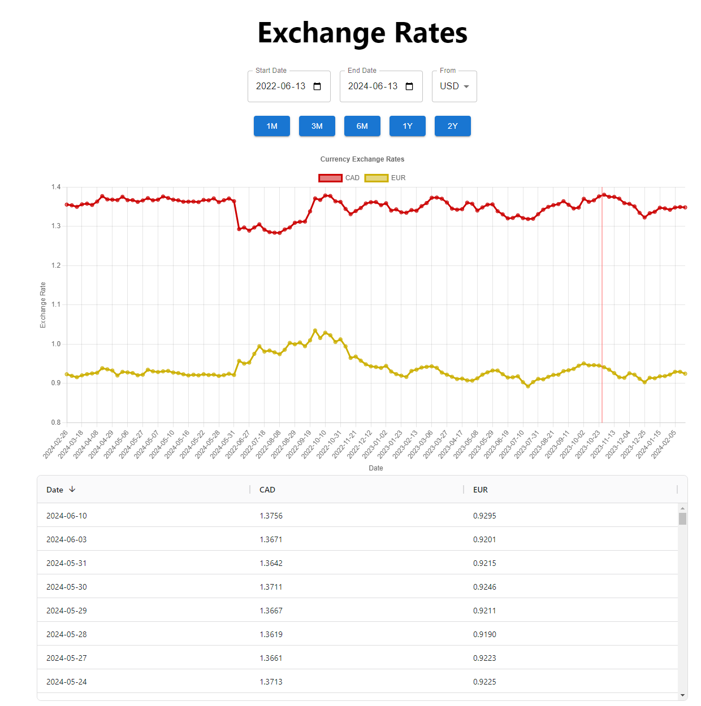

# Exchange Rates Dashboard

The following project contains two directories Frontend & Backend. The frontend is built using React, Typescript, & Vite and the Backend is built using Python Django. The frontend is responsible for displaying the exchange rates and the backend is responsible for fetching the exchange rates from a postgres db hosted on Neon, and if the exchange rates are not stored for the date provided, then an api call is made to the frankfurter api to get the data and cache it in our db.

The frontend is hosted on Vercel and the backend is hosted on Render.

The backend also has a management command that can be used to fetch the exchange rates for the previous month and can be set up to run from a cron job that runs on the first day of each month.

## Installation

### Frontend

- npm i
- create .env file in the root and add the following
  VITE_BACKEND_URL=http://localhost:8000
- npm run dev

### Backend
***Take a look at the celery-async branch to see, the cron job set to call the management command and celery task set to save rates to db asynchronously.***

- create a virtual environment and activate it
- pip install -r requirements.txt
- create .env file in the root and add the following

  DEBUG=True
  SECRET_KEY=YOUR_SECRET_KEY
  PGHOST=YOUR_PGHOST
  PGDATABASE=YOUR_PGDATABASE
  PGUSER=YOUR_PGUSER
  PGPASSWORD=YOUR_PGPASSWORD

- python manage.py makemigrations
- python manage.py migrate
- python manage.py runserver

To run backend tests run `python manage.py test`

## Screenshots

